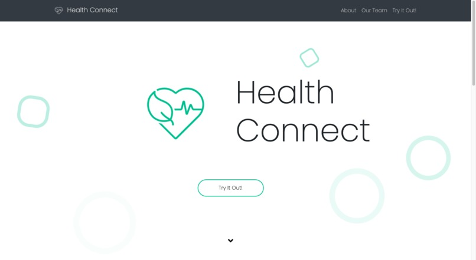

# Health Connect

A web app created for SETHacks() 2021!
View our submission [here](https://devpost.com/software/health-connect-037wli)

## Description

Health Connect’s goal is to make health care as easily accessible as possible, in the shortest amount of time. With a database containing every healthcare facility in Canada, including hospitals, ambulatory care, and nursing/residential facilities, our app will rank all nearby options by order of convenience. The algorithm considers the commute times and the current wait times to determine the optimal facility for the user. Health Connect’s strength is in its simplicity. With a polished and simple UI as well as a seamless UX, it is designed to be intuitive for any user, including seniors.

## Instructions for Use

1. Load the application and click "Try It Out!" in the top right corner
2. Enter your preferences! Choose a province, health care facility type, and the longest time you're willing to wait to see a healthcare professional
3. Browse through your nearby options
4. Once you find a hospital that suits your needs, click on the facility name to open a Google Maps link to help you navigate to the location!

## How can I use Health Connect?

### Prerequisites

* Python
* Flask
* Numpy
* Pandas
* Geocoder
* Geopy
* WTForms

### Download Instructions

1. Clone the Health Connect repository
2. Navigate to the project directory on the command line
   &nbsp;&nbsp;`cd .../Health-Connect`
3. Set the environment variable FLASK_APP to main.py` `
   &nbsp;&nbsp;&nbsp;&nbsp;&nbsp;&nbsp;Mac/Linux:&nbsp;&nbsp;
   `export FLASK_APP=main.py  `
   &nbsp;&nbsp;&nbsp;&nbsp;&nbsp;&nbsp;Windows:&nbsp;&nbsp;
   `set FLASK_APP=main.py `
4. Run the Flask application
   &nbsp;&nbsp;`flask run`
5. View the web application on localhost:5000

## What did we use?

* Figma, a wireframing software in planning out the UI/UX
* Flask for its simplicity in creating web applications
* Pandas, a Python library for data manipulation and analysis, to process our large dataset
* Geocoder and Geopy to determine the user’s location and calculate their distance from each facility
* WTForms, a flexible forms validation and rendering library for Python web development, to integrate HTML forms in our Flask application
* Bootstrap 4 to create our appealing and responsive front-end

## What comes next?

The next steps for Health Connect include developing a Hospital-end wait time calculator to provide live wait time updates. We plan to first create a basic wait time calculator that generates an estimated time based on the number of patients and the number of staff members working in the facility at that time. We then want to incorporate AI into our work to evaluate the complexity of entered patient symptoms and generate a highly personalized wait time. This way, one that comes with a small ankle injury may be assigned a shorter wait time than someone who reports chest pain. With this system in place, Health Connect will be able to produce more accurate estimates for users.

## Sources

Our dataset used was taken from Statistics Canada's [Open Database of Healthcare Facilities](https://www.statcan.gc.ca/eng/lode/databases/odhf)

## Contributors

* [Mufeng Liu](https://github.com/mufengl)
* [Jamie Tsai](https://github.com/JamieTsai1024)
* [Razi Syed](https://github.com/razlze)
* [Jeffrey Zhang](https://github.com/topcheese044)
